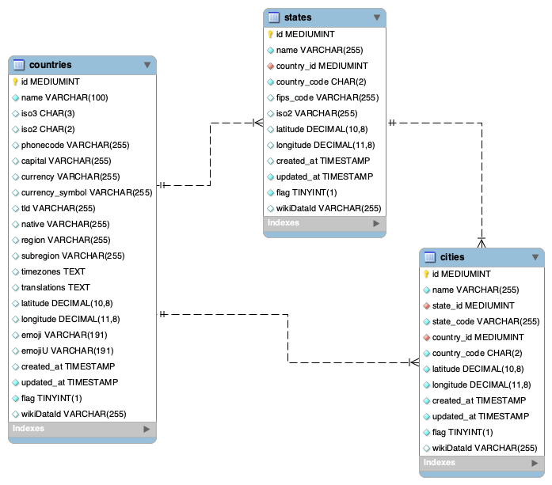

# MySQL project
Authors: Wooyoung Jeong and Jisu Kim

# Research Questions
1. Find the characteristics of the divided regions based on latitude and longitude.
2. Find statistical characteristics by researching relationship between countries, regions, states, and cities.

# Abstract
In this data set, there is detailed information of each city, state and region with specific latitude. There are 250 countries, 4857 states, and 147400 cities. Based on specific geographical information of many different areas, we decided to dig further to find out specific unique information about areas that are separated by certain longitude and latitude points.

# Countries States Cities DataBase
Dataset: 🌍https://www.kaggle.com/datasets/tanweerulhaque/countries-states-cities-dataset

# Schemas Roadmap



# MySQL code
```SQL

```

# Results


First three graphs show the distribution of countries, states and cities in specific areas that were divided by latitude.
More than half of states and cities are located between Arctic and Tropic of Cancer region. It seems very reasonable due to very friendly weather in this area.
However, there are more countries in the area between Tropic of Cacncer because it contains all area of Southern East Asia, Africa, and South America that have most of small countries in the world.


This graphic shows the relationship among coutries, states and cities in each different area.
The graphic shows very noticable characteriestic. Becuase human can only live in land, not ocean, the difference of states/countries and cities/states becomes extremely large when the areas are mostly made of ocean (Tropic of Capricorn - Antarctic). However, the ratio of 3 statistics become very similar when land portion takes most part of the area (Arctic-Tropic of Cancer).


This graph shows the most frequently used currency in specific area that were divided by latitude.
This graphic gives very straightforward statistics.
Becuase most cultural development through eras grew together in similar latitude, most regions have very dominated currency. (Arctic - Tropic of Cancer [EURO]).


